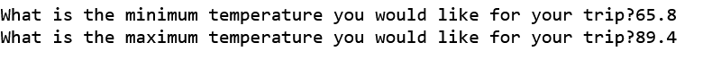
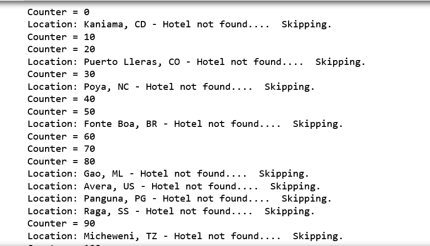
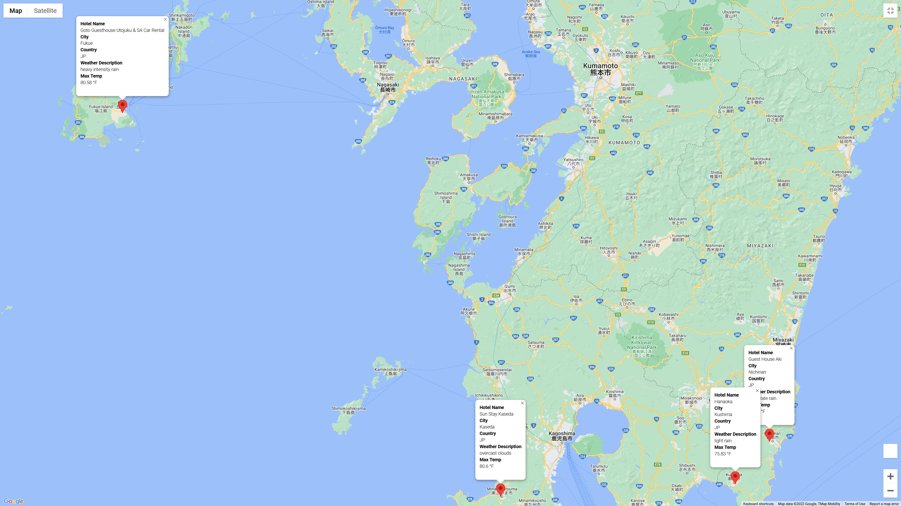
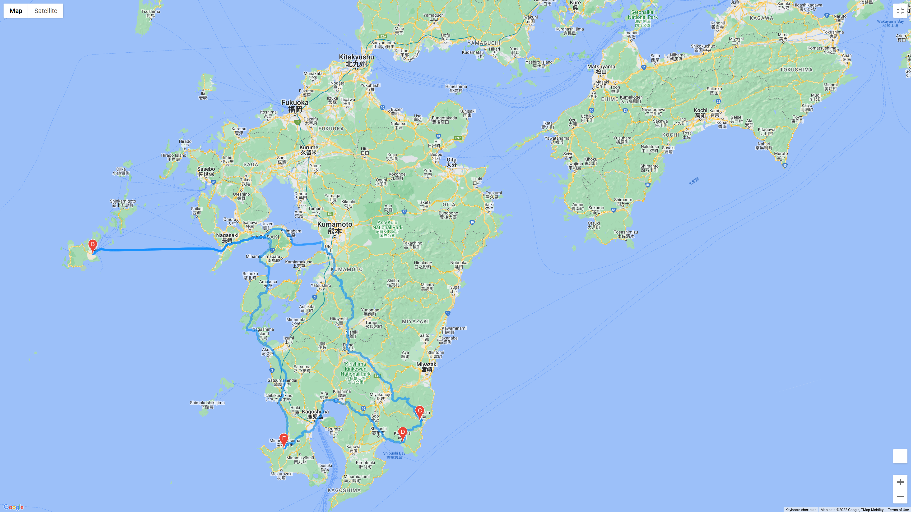

# WeatherPy - Weather and Mapping APIs

## Overview

This project utilized the following APIs for data collection and visualization:
* OpenWeatherMap API
* Google maps and NearbyPlaces APIs
* Google Directions API

Project Criteria:

* Weather description to be collected from weather data and displayed with destination information
* Prompt for user input to filter the list of destinations based on temperature preferences, and present this on a map.
* Build and display a travel itinerary with selected destinations.  Map the itinerary and provide the destination information on the map.

# Retrieve Weather Data
A set of 3000 random Latitude and Longitude combinations was constructed to provide search data which was consumed by cityPy to try to locate nearby cities.  The located cities became the potential travel destinations. Using the identified cities, the OpenWeatherMap API was used to retrieve the city weather data.

The cities and corresponding weather data was used to generate a world map with markers for all the cities.  Selecting a marker displays an info box with the city name, a hotel, and weather details.

# Create a Travel Destinations Map
Prompts were used to identify a desired temperature range which was used to filter the range of possible destinations.

Using the temperature criteria, the google nearby search API was used to locate a hotel near the target Latitude and Longitude.  If a hotel could not be located, the search skipped that city and proceeded.  Upon the conclusion of this search, cities without a hotel were dropped from the DataFrame.

# Create A Custom Travel Itinerary
Four city destinations in Japan were selected to display a potential travel itinerary.  A map of the selected destinations was created with city markers and an info box to provide details.

A driving itinerary was constructed using the Google Maps Directions API, using the preferred sequence for travel between the cities.  The itinerary was a round trip that started and ended in the same city.  The city labeled "E" is the start/end of the driving route.

